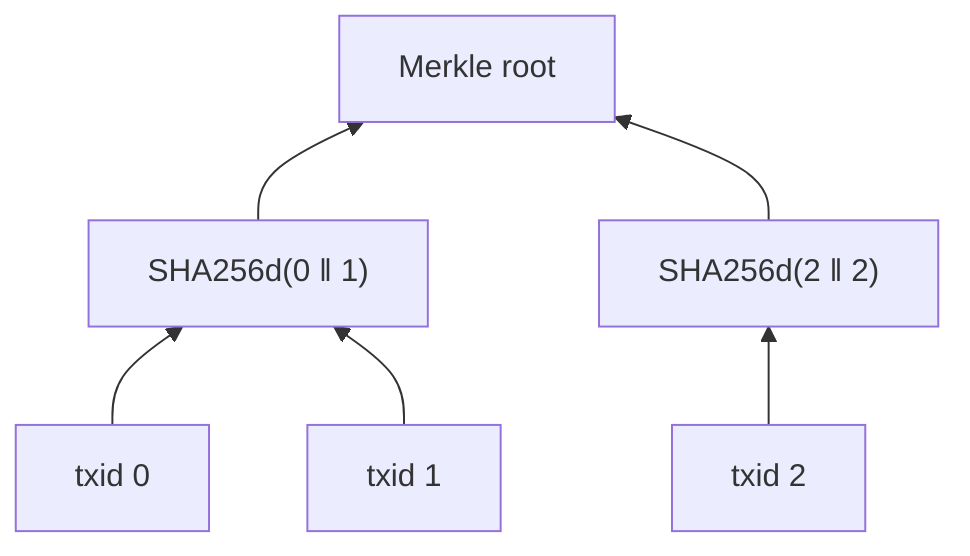

## Parallel Bitcoin Merkle engine: SHA-256d trees, SPV proofs, PoW and SegWit commitment checks

A parallel, Bitcoin-compatible Merkle engine in Java: computes Merkle roots over large transaction sets, generates and verifies SPV inclusion proofs, and verifies raw Bitcoin blocks, including their Merkle root, proof of work, and SegWit witness commitment.

Every Bitcoin block commits to its transactions through a single 32-byte **Merkle root** in its header. That root is what lets a lightweight wallet confirm that a payment is in a block using a proof of about 20 hashes instead of downloading the block, and what lets any node detect a single altered byte in any transaction. This project implements that machinery from first principles, parallelizes the hashing across threads, and validates the result byte for byte against real Bitcoin blocks.

---

## Highlights

- **Verified against real Bitcoin data.** The engine reproduces the header Merkle roots and block hashes of four real blocks, including the genesis block and a SegWit mainnet block (height 542,213), whose witness commitment it also validates. It also reproduces the published Merkle root of block 100,000.
- **Consensus-accurate details.** It follows Bitcoin's internal and display byte orders, odd-level duplication, txid vs. wtxid serialization, compact difficulty targets, canonical CompactSize encoding, and detection of the CVE-2012-2459 Merkle mutation.
- **Compact proofs.** For 1,000,000 transactions, an inclusion proof is 20 hashes (1.4 KB of text), versus 65 MB for the full transaction list.
- **Parallel by construction.** Each level of the tree, and each transaction's hash, is computed across a reusable thread pool without locks.
- **Tested.** 40 JUnit tests, including tamper tests showing that a changed transaction breaks the Merkle root, a changed nonce breaks proof of work, and changed witness data breaks only the witness commitment.

---

## What It Does

| Command | Purpose |
|---|---|
| `root` | Computes the Merkle root of a list of transaction IDs |
| `proof` | Builds an inclusion proof for one transaction |
| `verify` | Checks an inclusion proof against a Merkle root, as a light client would |
| `block` | Verifies a raw block: Merkle root, mutation, proof of work, and witness commitment |
| `bench` | Benchmarks sequential and parallel root computation |
| `generate` | Writes random transaction IDs for testing |

### Example: verifying a real SegWit block

```text
$ java -jar target/blockchain-transaction-concurrency.jar block src/test/resources/blocks/mainnet-542213-segwit.hex

Block 000000000000000000143a2c56c0214236dadfd30df41d4a0345492ad6d861ec
  Size:          2,355 bytes
  Transactions:  4 (2 SegWit)
  Previous:      000000000000000000085a38ccf9c046c51b96add547c466ccba3612b1eb8089
  Timestamp:     2018-09-20T07:48:47Z (1537429727)
  Version:       0x20000000

  Header Merkle root:    64a8b69cb7100430aec35825d54a48f4434f3db52dff8a02709aee3a659b5e13
  Computed Merkle root:  64a8b69cb7100430aec35825d54a48f4434f3db52dff8a02709aee3a659b5e13
  [ok]   Merkle root matches the header
  [ok]   No duplicate-pair mutation (CVE-2012-2459)
  [ok]   Proof of work meets the header target (bits 0x172819a1)
  [ok]   Witness commitment: valid (commitment 4a657fcaa2149342376247e2e283a55a6b92dcc35d4d89e4ac7b74488cb63be2 matches)

  Result: VALID  [1 thread(s), 66.655 ms]
```

### Example: proving one transaction among a million

```text
$ java -jar target/blockchain-transaction-concurrency.jar generate txids.txt --count 1000000
Wrote 1,000,000 random txids to txids.txt

$ java -jar target/blockchain-transaction-concurrency.jar proof txids.txt --index 777777 --out proof.txt
Wrote proof for leaf 777,777 of 1,000,000 (20 hashes) to proof.txt

$ java -jar target/blockchain-transaction-concurrency.jar verify proof.txt \
      --txid 3e6fb12a882df8536e37cb80aef213fad70222584809dc55b164d76a6b57833c \
      --root c2f0c00086118fe158e123909998a0dda2c1e5d232575ecce0bdcdfaa1d02081
VALID: txid is included at index 777,777 (20-hash proof)
```

The verifier needs only the transaction ID, the root, and the proof; it never sees the other 999,999 transactions.

---

## How It Works

### Merkle trees, as Bitcoin builds them

Transaction IDs form the leaves. Each level above is built by hashing adjacent pairs with double SHA-256, until a single hash, the root, remains:



Bitcoin-specific rules the engine implements:

| Rule | Detail |
|---|---|
| Node function | `SHA256(SHA256(left ‖ right))` over 64 bytes |
| Odd levels | The last hash is paired with itself, as with txid 2 above |
| Byte order | Hashes are computed in internal byte order but displayed reversed, as in block explorers and `bitcoin-cli`; the engine converts only at input and output |
| Empty list | The root is 32 zero bytes; a single transaction's root is its own txid |
| Mutation | Because of odd-level duplication, `[a, b, c]` and `[a, b, c, c]` share a root (CVE-2012-2459). As in Bitcoin Core, a tree with two equal adjacent hashes at a real pair position is flagged as mutated |

### Parallel level hashing

All nodes in one level are independent, so each level is split into contiguous ranges that worker threads hash concurrently. Each thread writes only its own slice of the next level, so no locks are needed. Levels are computed in order, since each depends on the one below. Upper levels with fewer than 1,024 nodes per chunk run on the calling thread, where dispatching would cost more than it saves.

Levels are stored as flat `byte[]` arrays of 32-byte hashes rather than one object per hash. That keeps each level contiguous in memory and avoids allocating millions of objects. Computing only a root keeps two levels alive at a time. Building a full tree for proofs keeps every level, which is about twice the size of the leaves.

Each thread reuses its own `MessageDigest`, so hashing allocates nothing on the hot path.

### Inclusion proofs (SPV)

A proof for leaf `i` lists the sibling hash at each level on the path to the root: `⌈log₂ n⌉` hashes. The verifier rehashes upward, placing the running hash on the left or right according to the bits of `i`. If the result equals the trusted root, the transaction is in the tree. Changing any sibling, the index, or the transaction causes verification to fail.

Proof file format, one item per line:

```text
# txid 3e6fb12a882df8536e37cb80aef213fad70222584809dc55b164d76a6b57833c
# root c2f0c00086118fe158e123909998a0dda2c1e5d232575ecce0bdcdfaa1d02081
index 777777
<sibling hash at the leaf level>
<sibling hash one level up>
...
```

### Block verification

`block` parses a serialized block with a strict parser, then runs four checks:

1. **Merkle root.** Every txid is recomputed from the raw transaction bytes, in parallel, and the root is rebuilt and compared with the header.
2. **Mutation.** The transaction list must not have the CVE-2012-2459 duplicate-pair shape.
3. **Proof of work.** The block hash, read as a 256-bit number, must not exceed the target decoded from the header's compact `bits` field. Negative, zero, and overflowing encodings are rejected, as in Bitcoin Core.
4. **Witness commitment (BIP 141).** SegWit transactions have two IDs:
   - the **txid** hashes the transaction *without* its witness (signature) data, and is what the header's Merkle root commits to;
   - the **wtxid** hashes it *with* the witness data.

   The coinbase transaction commits to a second Merkle tree built from wtxids. The verifier rebuilds that tree, combines its root with the coinbase's witness reserved value, and compares the result with the commitment in the coinbase output.

The parser enforces Bitcoin's serialization rules: CompactSize integers must be canonical, every length must fit in the data, SegWit transactions must carry witness data, and the block must end exactly after its last transaction.

---

## Project Structure

```text
src/main/java/io/github/ak811/merkle
├── crypto
│   ├── Sha256d.java              # Double SHA-256 with per-thread digests
│   ├── Hash32.java               # 32-byte hash with internal/display byte order
│   └── Hex.java
├── concurrent
│   ├── WorkerPool.java           # Reusable thread pool for chunked index-range loops
│   └── ParallelExecutionException.java
├── merkle
│   ├── MerkleLevels.java         # Level function: pair hashing, odd duplication, mutation
│   ├── LevelHasher.java          # Strategy interface for computing one level
│   ├── SequentialLevelHasher.java
│   ├── ParallelLevelHasher.java  # Splits each level across the worker pool
│   ├── MerkleRoot.java           # Root computation with two live levels
│   ├── MerkleTree.java           # Full tree for proof generation
│   ├── MerkleProof.java          # Inclusion proofs: build, verify, text format
│   └── MerkleResult.java
├── bitcoin
│   ├── Block.java                # Strict block and transaction parser
│   ├── BlockHeader.java          # Header fields, block hash, compact target, proof of work
│   ├── TransactionLayout.java    # Byte ranges of a transaction's parts
│   ├── BlockVerifier.java        # Merkle, mutation, and witness commitment checks
│   ├── BlockReport.java
│   ├── WitnessCheck.java
│   ├── ByteReader.java           # Bounds-checked little-endian reader, CompactSize
│   └── BlockFormatException.java
├── io
│   ├── TxidFile.java             # Txid list files and random txid generation
│   ├── TxidList.java
│   └── BlockFile.java            # Raw or hex block files
├── bench
│   └── Benchmark.java            # Warm-up and timed runs with result checks
└── cli
    ├── App.java                  # Command-line interface
    └── Args.java

src/test
├── java/...                      # 40 JUnit 5 tests
└── resources
    ├── blocks/                   # Four real Bitcoin blocks, as hex
    └── txids/block-100000.txt    # Transactions of Bitcoin block 100,000
```

---

## Requirements

- JDK 17 or later
- Maven 3.8 or later

The application uses only the JDK. JUnit is the only dependency and is used for testing.

---

## Build

```bash
mvn package
```

This compiles the code, runs the tests, and produces `target/blockchain-transaction-concurrency.jar`.

---

## Usage

```text
java -jar target/blockchain-transaction-concurrency.jar <command> [options]
```

| Command | Options |
|---|---|
| `root <txids-file>` | `--threads N` |
| `proof <txids-file>` | `--index N` or `--txid HASH`; `--out FILE`; `--threads N` |
| `verify <proof-file>` | `--txid HASH --root HASH` (both required) |
| `block <block-file>` | `--list-txids`; `--threads N` |
| `bench` | `--leaves N` (default 1,000,000); `--thread-counts 1,2,4`; `--warmup N` (3); `--repeat N` (5); `--seed N` |
| `generate <out-file>` | `--count N` (required); `--seed N` |

`--threads` defaults to the number of available processors.

**Input formats:**

- **Txid files** contain one 64-digit hex txid per line, in display order. Blank lines and `#` comments are ignored; invalid lines are reported with their line number.
- **Block files** contain a serialized block as raw bytes or hex text, detected automatically. For example, the output of `bitcoin-cli getblock <hash> 0` can be saved and verified directly.

**Exit status:** 0 on success, 1 on error, 2 on invalid usage, and 4 when a proof or block fails verification. This makes the tool usable in scripts.

---

## Benchmark

### Setup

| Parameter | Value |
|---|---|
| Workload | Merkle root of 1,000,000 random txids: 1,000,007 double-SHA-256 node hashes |
| Hardware | Linux container with 1 available CPU |
| JVM | OpenJDK 21 |
| Method | 3 warm-up runs and 7 timed runs per configuration; median reported |

### Results

| Configuration | Median | Relative | Node hashes per second |
|---|---:|---:|---:|
| Sequential | 182.6 ms | 1.00× | 5.48 million |
| Parallel, 1 thread | 194.1 ms | 0.94× | 5.15 million |
| Parallel, 2 threads | 198.6 ms | 0.92× | 5.04 million |
| Parallel, 4 threads | 223.9 ms | 0.82× | 4.47 million |

All configurations computed the same root.

### Analysis

**Single-core throughput.** One core computes about 5.5 million double-SHA-256 node hashes per second, so the root of a million-transaction tree takes under 0.2 seconds.

**No speedup is possible on this machine.** With one CPU, extra threads take turns on the same core, so the results measure the cost of dispatching work: throughput drops by about 6% with one worker thread and by 18% with four threads competing for one core.

**Expected behavior on multi-core hardware.** Unlike the memory-bound loops in many parallel benchmarks, Merkle hashing is compute-bound: each node reads 64 bytes and then performs two full SHA-256 compressions. The lower levels, which contain almost all of the work, split into large independent chunks. This workload should therefore scale well with core count, until the upper levels, which are too small to split, begin to dominate. To measure it, run:

```bash
java -jar target/blockchain-transaction-concurrency.jar bench --leaves 4000000 --repeat 7
```

By default, this tests 1, 2, 4, and so on up to every available core.

---

## Testing

| Area | Coverage |
|---|---|
| Hashing | Known double-SHA-256 vectors, multi-range and pair hashing, byte-order conversion, hex parsing |
| Worker pool | Every index visited exactly once across thread counts and sizes, result combining, and failure propagation |
| Merkle roots | Bitcoin block 100,000; empty and single-leaf trees; agreement of sequential and parallel hashing with an independent reference for every size from 0 to 130; large trees up to 262,144 leaves; CVE-2012-2459 detection; input immutability |
| Proofs | Every leaf of every tree size from 1 to 70; wrong leaf, index, sibling, or root; text round trip; malformed proofs |
| Real blocks | Block hash, Merkle root, transaction count, SegWit count, proof of work, and witness commitment for four real blocks |
| Tampering | A changed transaction breaks the Merkle root; a changed nonce breaks proof of work; changed witness data leaves txids intact but breaks the witness commitment |
| Parsing | Truncated blocks, trailing bytes, empty blocks, and non-canonical CompactSize encodings; compact target decoding, including negative, zero, and overflowing encodings |
| CLI | Every command, including proof round trips, exit statuses, and usage errors |

The block fixtures are real Bitcoin blocks taken from the test fixtures of [bitcoinjs-lib](https://github.com/bitcoinjs/bitcoinjs-lib) (MIT license).

---

## Scope and Limitations

This tool verifies that a block's contents match its header's commitments and that the header carries valid work for its own target. It is not a full node. In particular, it does not:

- validate scripts or signatures,
- check spent outputs against the UTXO set,
- confirm that the header's target is correct for its height, which requires the preceding chain, or
- enforce coinbase, block weight, or other consensus limits.

---

## Project History

This repository originally contained a Java concurrency exercise that combined numbers from a file with XOR using threads, a synchronized variant, and separate processes, described as blockchain transaction processing. It has been rewritten to implement the structure Bitcoin actually uses to commit to its transactions, the Merkle tree, and to parallelize its computation.

---

## License

MIT. See [LICENSE](LICENSE).
